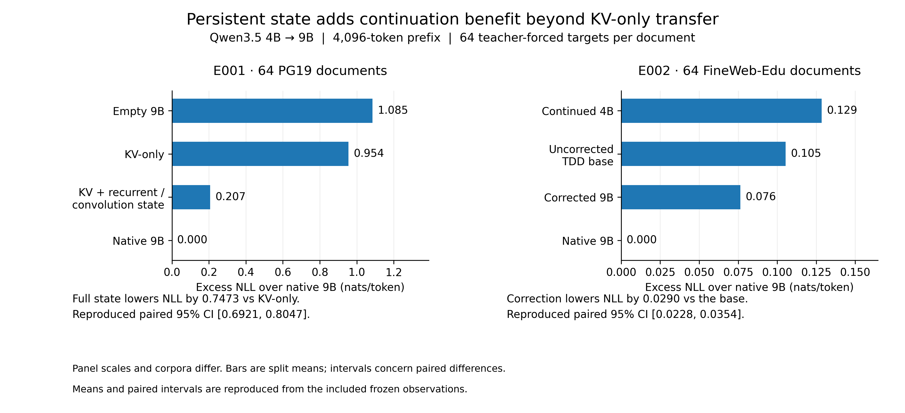

# LatentPort

Cross-model transfer of persistent inference state without prefix replay.

Can one language model hand its live memory to another?

LatentPort demonstrates a Qwen3.5 4B → 9B handoff where the 9B receiver
continues from transferred inference state while processing zero historical
target-prefix tokens.

The transferred object goes beyond KV cache: it includes persistent Gated
DeltaNet recurrent state and convolution history.

**Paper:** [arXiv:2609.25053](https://arxiv.org/abs/2609.25053) ·
**Hugging Face:** [papers/2609.25053](https://huggingface.co/papers/2609.25053) ·
**Code:** [github.com/mmprotest/latentport-paper](https://github.com/mmprotest/latentport-paper) ·
**Reproduce:** [docs/REPRODUCIBILITY.md](docs/REPRODUCIBILITY.md)

`LatentPort.pdf` in this repository is the included submission copy. Cite the arXiv version.



Lower excess NLL is better; zero is the native 9B reference. Each panel scores 64 teacher-forced targets per document after a 4,096-token prefix. The panels use different corpora and scales. Intervals describe paired differences, not individual bars. [Vector PDF](figures/main_handoff_comparison.pdf) · [figure notes](figures/README.md).

## Key results

Paper rounding is shown first. Full precision is in the frozen results and in [tables/](tables/).

**E001 · 64 PG19 documents**

- KV-only excess NLL: **0.9544**
- KV + persistent GDN-state package excess NLL: **0.2070**
- Improvement: **0.7473** nats/token, 95% paired CI **[0.6921, 0.8047]**
- **64/64** documents improved

**E002 · 64 fresh FineWeb-Edu documents**

- Corrected 9B excess NLL: **0.076** (full precision 0.076367)
- Continued 4B excess NLL: **0.129** (full precision 0.128512)
- Native context recovery: **0.918** (full precision 0.917755)
- The 9B receiver processes **zero** historical target-prefix tokens
- Corrected 9B NLL is 1.989 versus 2.042 for continued 4B (difference −0.0521, 95% CI [−0.0843, −0.0185])

The E001 hero bar is the fully translated GDN package, the preregistered primary contrast. Direct GDN reuse is a separate comparison below. E002's selected base is TDD: translated KV with directly copied recurrent and convolution state, plus a rank-4 correction of 434,176 parameters.

## What is transferred?

The source is `Qwen/Qwen3.5-4B-Base`. The receiver is `Qwen/Qwen3.5-9B-Base`. Hidden widths differ (2,560 versus 4,096). Persistent-state shapes match, which makes a copy possible. Usefulness is measured by teacher-forced continuation, not by shape agreement.

The handoff can include:

- attention KV cache
- persistent Gated DeltaNet recurrent matrices
- convolution history
- in E002, a small pair-specific residual correction fit on this sibling pair

The receiver does not reread the historical prefix. Both preregistrations set `target_prefix_replay_tokens` to 0.

## Direct reuse vs learned translation

A lower tensor reconstruction error did not guarantee a better functional handoff.

On E001 validation data, the learned recurrent mapper reduced mean normalized Frobenius error from **0.6732** for direct copying to **0.5037**. With translated KV held fixed, the behavioral continuation went the other way:

- full learned translation NLL: **2.3679**
- direct GDN reuse NLL: **2.2913**
- direct-reuse advantage: **0.0766** nats/token

That E001 comparison changes recurrent and convolution treatment together. It is not an isolated causal test of recurrent tensor reconstruction error.

The fresh E002 factorial, 32 validation documents, separates the component choices. Positive values below mean higher NLL, so direct reuse is better:

- recurrent state, translated minus direct: **+0.0280** nats/token, 95% CI **[+0.0104, +0.0475]**
- KV translation helps: **−0.0705**, 95% CI **[−0.1009, −0.0409]**
- convolution: **−0.0004**, 95% CI **[−0.0026, 0.0018]**

The convolution interval is small and includes zero. It does not establish a convolution winner. On the separate 64-document test, the selected direct-GDN base (TDD, excess NLL 0.105) still beats full translation (TTT, excess NLL 0.134).

In the fresh E002 factorial, directly reusing recurrent state outperformed translating it. This is consistent with partial functional compatibility of persistent-state coordinates between the tested Qwen3.5 siblings.

## Reproduce the paper results

The repository includes the frozen E001/E002 evidence required to regenerate the published headline aggregate statistics, tables, and figures.

This is distinct from re-running the original GPU experiment from scratch, which requires the specified model checkpoints and runtime environment.

From a Python 3.11 environment:

```bash
python -m pip install -r requirements.txt
python analysis/extract_results.py
python analysis/verify_results.py
python analysis/reproduce_figures.py
python analysis/reproduce_tables.py
python analysis/validate_public_metadata.py
```

`verify_results.py` is the integrity check for sealed hashes and headline statistics. Details, including what a from-scratch rerun still requires, are in [docs/REPRODUCIBILITY.md](docs/REPRODUCIBILITY.md).

## Repository structure

| Path | Purpose |
|---|---|
| [e001_handoff/](e001_handoff/) | E001 protocol, frozen manifest, and LOCKED evidence |
| [e002_coupler/](e002_coupler/) | E002 protocol, factorial, correction selection, and LOCKED evidence |
| [analysis/](analysis/) | Extraction, verification, tables, and figures |
| [derived/](derived/) | Document-level observations regenerated from the frozen evidence |
| [figures/](figures/) / [tables/](tables/) | Public figures and numeric tables |
| [docs/](docs/) | Reproducibility, artifact map, limitations, and release notes |

Large local tensors are gitignored. They are not required to recompute the published headline statistics.

## Scope and limitations

- One model family, and one architecture-matched Qwen3.5 4B → 9B sibling pair
- One direction
- 4,096-token historical prefix and 64 teacher-forced targets per document
- The near-native gate did not pass
- The conditional 16K branch was not run
- Free-generation equivalence is unproven
- Downstream-task equivalence is unproven
- A general cross-model state interface is a research direction, not an established result
- No production serving speedup claim follows from this paper

E001's stronger full-state gate also fails (excess NLL 0.2070, TQR −0.4132). E002's label `FULL_STATE_HANDOFF` is a registered threshold result, not an equivalence or deployment claim. [Full limitations](docs/LIMITATIONS.md) · [claims and evidence](docs/CLAIMS_AND_EVIDENCE.md).

## Citation

```bibtex
@misc{villani2026latentport,
  author = {Villani, Simon P.},
  title = {{LatentPort}: Beyond {KV} Cache - Cross-Model Transfer of Recurrent Memory in Hybrid Language Models: A {4B}-to-{9B} Hybrid-State Handoff Without Target Prefix Replay},
  year = {2026},
  eprint = {2609.25053},
  archivePrefix = {arXiv},
  primaryClass = {cs.AI},
  url = {https://arxiv.org/abs/2609.25053}
}
```

Machine-readable metadata is in [CITATION.cff](CITATION.cff). The `cs.AI` class is the category on the included submission PDF.

## License

The repository includes the Apache License, Version 2.0, in [LICENSE](LICENSE). [LICENSE_NOTICE.md](LICENSE_NOTICE.md) records that the intended scope of that license, in light of patent-pending work, still needs an owner decision. This README does not change those terms.
