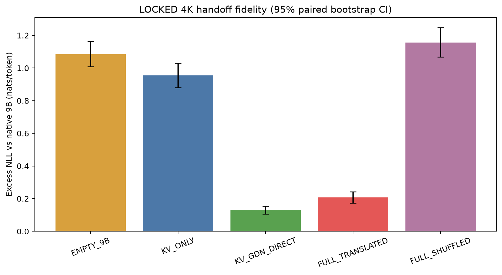
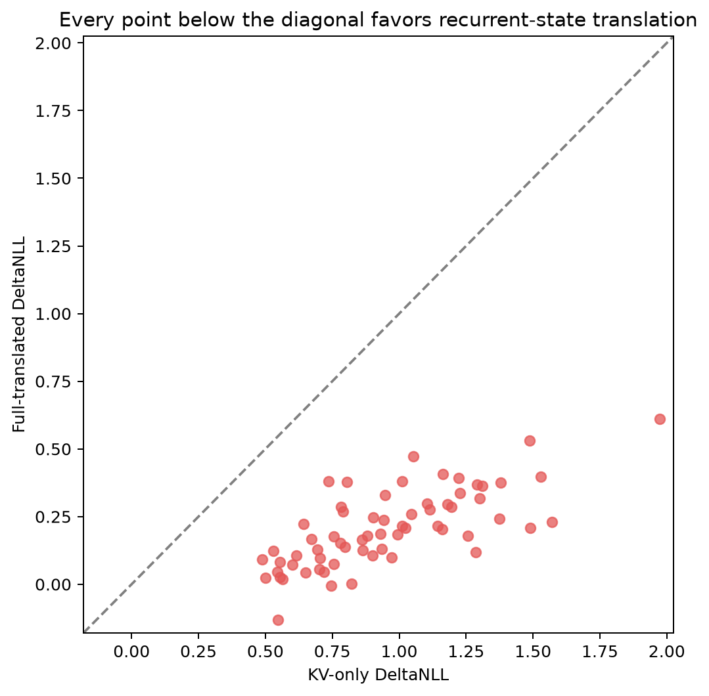
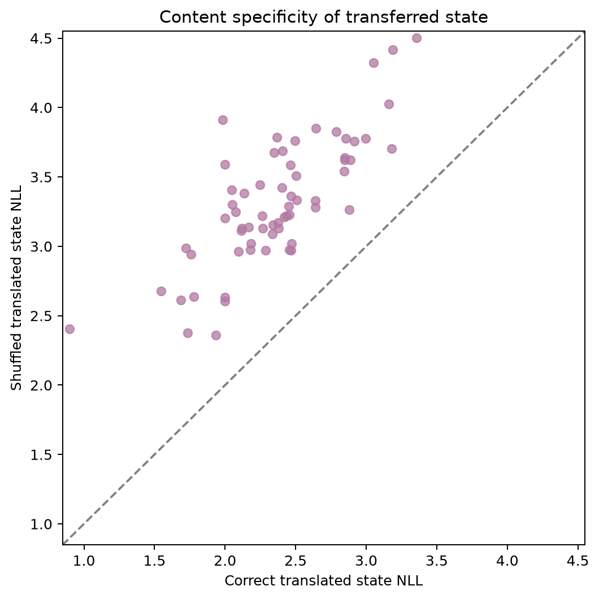
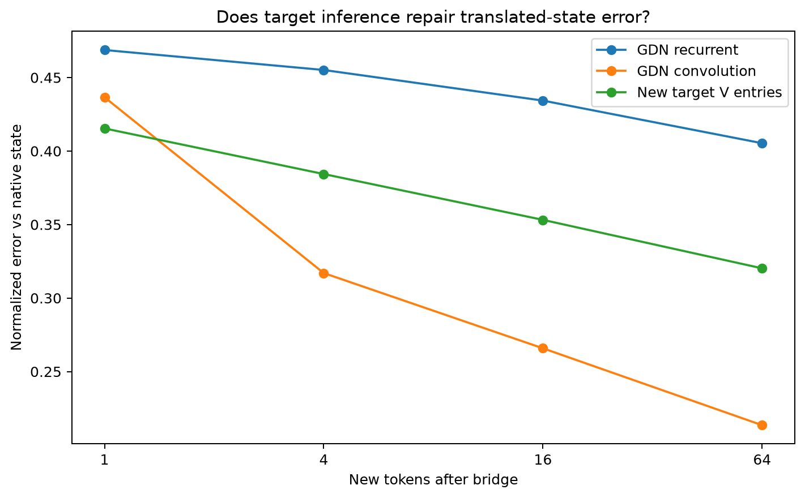
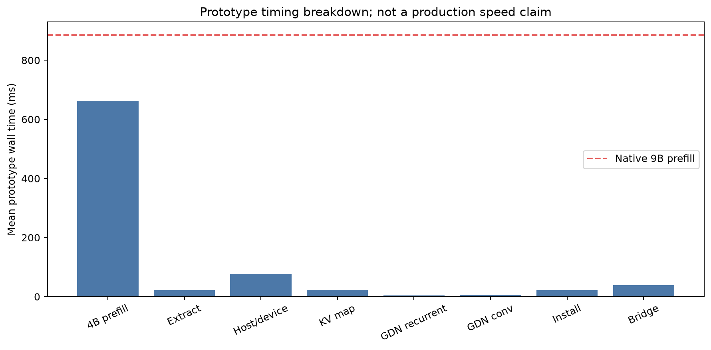
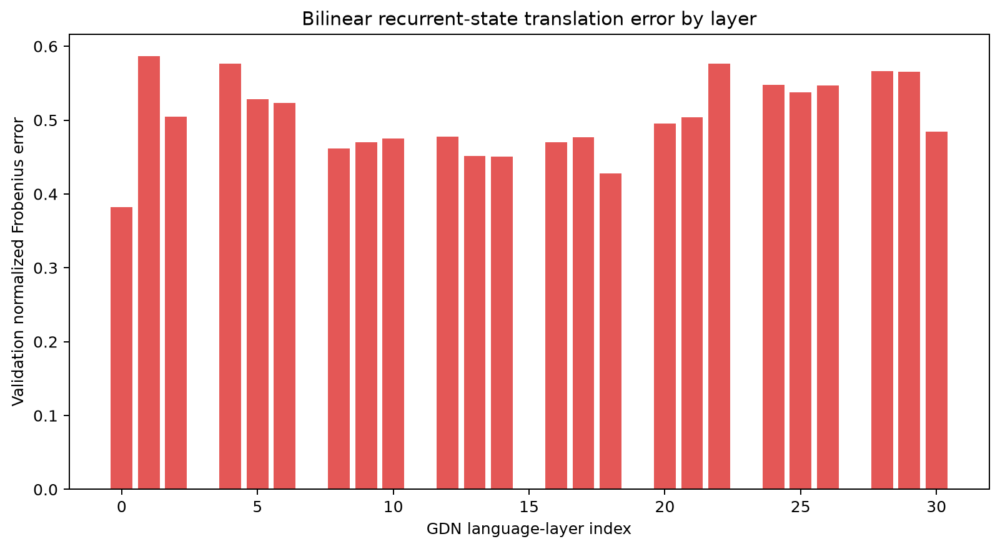
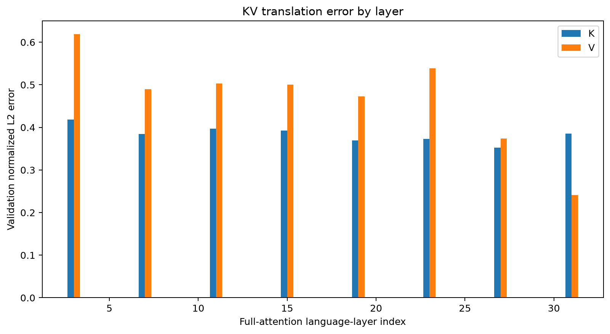
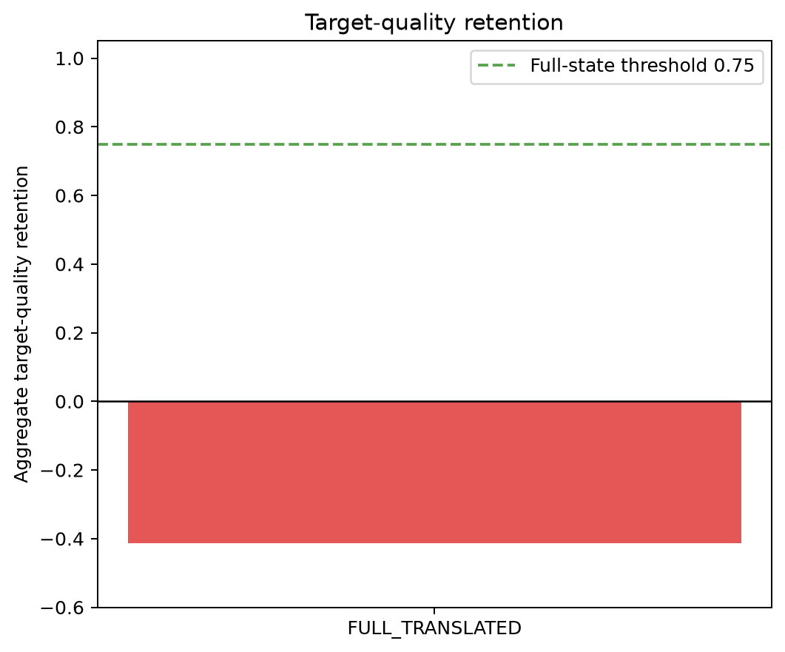
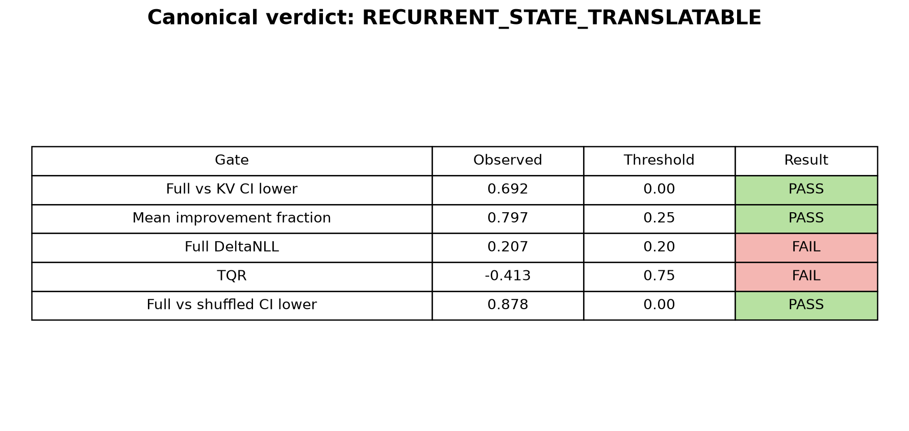

# LatentPort E001: Handoff

## Can Qwen3.5-9B Continue From Qwen3.5-4B's Translated Live Inference State?

# Executive Finding

Yes—but only at the experiment's intermediate success rung. Both official Base models passed exact same-model live-state capture and restore: 16/16 contexts each, 100% top-1 agreement, minimum next-logit cosine at least 0.99999988, and zero maximum logit difference. The implementation gate therefore passed.

Direct copying was not useless. In the noncanonical smoke set, `DIRECT_FULL` reached only +0.198 nats/token over native 9B despite no training. In the LOCKED diagnostic, translated KV plus directly copied GDN state reached +0.130. This was better than the learned full translator, so the matching GDN geometry appears meaningfully aligned and the bilinear/linear maps did not improve every component.

KV-only transfer materially beat an empty 9B state by 0.130 nats/token (95% CI 0.117–0.144), but remained far from native: NLL 3.115 versus 2.161. Adding translated recurrent and convolution memory reduced NLL to 2.368. The full-versus-KV gain was 0.747 nats/token (95% CI 0.692–0.805), a 79.7% mean relative reduction in KV-only excess NLL. This satisfies the recurrent-memory novelty gate.

Full handoff nevertheless failed. Its mean excess NLL was 0.207, just above the 0.20 ceiling, and aggregate TQR was −0.413, far below 0.75: on this split, full handoff was worse than native 4B even though it was close to native 9B. The shuffled state was much worse (NLL 3.316), so the useful signal was context-specific. Target inference partially repaired state error over 64 tokens, but did not converge to native state.

The 16K test did not run because the 4K result did not reach `FULL_STATE_HANDOFF`. Oracle diagnostics did not run because full translation passed the frozen primary full-versus-KV gate.

**Canonical verdict: `RECURRENT_STATE_TRANSLATABLE`.** Low-capacity translation of Gated DeltaNet recurrent state improved cross-model continuation fidelity beyond KV translation alone. It did not establish portable full model memory.

**Exact next hypothesis:** H2: Cross-component coupling between translated KV and translated Gated DeltaNet state is the main remaining source of target-fidelity loss, and a jointly fitted low-rank correction can close the gap without a deep nonlinear translator.

# Can the 9B Model Pick Up Where the 4B Model Left Off?

The handoff path was literal:

1. 4B read the 4,096-token prefix.
2. Its complete persistent state was captured.
3. Frozen low-capacity maps translated KV, GDN recurrent memory, and GDN convolution memory.
4. A fresh 9B cache received that state.
5. 9B did not reread any prefix token.
6. 9B processed the one real bridge token and then the same 64-token teacher-forced continuation used by every target condition.

The answer is “partly.” Full translation was dramatically better than KV alone and preserved context-specific information, but did not meet the registered full-state fidelity and target-quality thresholds.

| Condition | NLL | DeltaNLL vs native | Top-1 vs native | JS divergence |
|---|---:|---:|---:|---:|
| NATIVE_9B | 2.1609 | 0.0000 | 1.000 | 0.0000 |
| SOURCE_4B | 2.3074 | 0.1465 | — | — |
| EMPTY_9B | 3.2457 | 1.0847 | 0.581 | 0.1720 |
| KV_ONLY | 3.1153 | 0.9544 | 0.600 | 0.1579 |
| KV_GDN_DIRECT | 2.2913 | 0.1304 | 0.821 | 0.0320 |
| FULL_TRANSLATED | 2.3679 | 0.2070 | 0.783 | 0.0468 |
| FULL_SHUFFLED | 3.3162 | 1.1553 | 0.556 | 0.1792 |

# Does Recurrent Memory Add Anything Beyond KV Cache?

Yes. This is the central positive result.

| Metric | KV_ONLY | FULL_TRANSLATED | Delta / effect | Bootstrap CI |
|---|---:|---:|---:|---:|
| Mean NLL | 3.1153 | 2.3679 | −0.7473 | [−0.8047, −0.6921] |
| Mean DeltaNLL | 0.9544 | 0.2070 | 0.7473 improvement | [0.6921, 0.8047] |
| Mean improvement fraction | — | — | 0.7965 | denominator-positive documents only |
| Median improvement fraction | — | — | 0.8022 | threshold 0.25 |
| Aggregate TQR | — | −0.4132 | failed | threshold 0.75 |

All 64 document points lay below the equal-performance diagonal. The registered paired bootstrap lower bound was positive, and both mean and median improvement fractions exceeded 0.25. Therefore the recurrent-state gate passed.

The result is narrower than full handoff. `KV_GDN_DIRECT` outperformed `FULL_TRANSLATED` by 0.0766 nats/token. That locked diagnostic suggests that direct GDN alignment was already useful and that the fitted recurrent/convolution translation introduced some error even while the complete learned condition still vastly improved on KV alone.

# Is the Transferred State About the Actual Context?

Yes. Rotating full translated states between documents raised NLL from 2.368 to 3.316. Correct full state beat shuffled state by 0.948 nats/token, with 95% paired-bootstrap CI [0.878, 1.022]. Shuffled state was slightly worse than the empty-state baseline, so the result is not explained by a generic late-state prior.

# Does the 9B Model Repair Translation Error After Handoff?

Partially. All tracked state errors declined as 9B processed new tokens, and recurrent cosine rose from 0.880 to 0.911. Error remained material after 64 tokens.

| New tokens | GDN recurrent normalized error | GDN recurrent cosine | Convolution error | New-K error | New-V error |
|---:|---:|---:|---:|---:|---:|
| 1 | 0.4687 | 0.8796 | 0.4366 | 0.4041 | 0.4154 |
| 4 | 0.4551 | 0.8868 | 0.3170 | 0.3860 | 0.3844 |
| 16 | 0.4343 | 0.8974 | 0.2658 | 0.3644 | 0.3532 |
| 64 | 0.4053 | 0.9112 | 0.2135 | 0.3391 | 0.3202 |

Only KV entries generated by 9B after handoff were compared; historical translated KV entries were excluded. The logit curve shows the same repair pattern: full-translated DeltaNLL was 0.217 at position 1, rose to 0.410 over positions 2–4, then declined to 0.177 over positions 17–64. The error neither compounded nor vanished.

# Is It Potentially Faster Than Re-Prefilling?

Possibly in this prototype, but E001 makes no production-speed claim.

| Stage | 4K mean wall time | 16K if run |
|---|---:|---:|
| Native 9B prefill | 885.2 ms | Not run |
| Source 4B prefill | 662.6 ms | Not run |
| Source state extraction | 21.7 ms | Not run |
| Host/device copy | 77.3 ms | Not run |
| KV translation | 22.6 ms | Not run |
| GDN recurrent translation | 3.5 ms | Not run |
| GDN convolution translation | 5.5 ms | Not run |
| Full-state installation | 21.7 ms | Not run |
| Bridge token | 38.6 ms | Not run |

The registered translation budget for a latency win was `885.2 − 662.6 = 222.6 ms`. Extraction plus translation plus installation consumed about 152.4 ms, leaving roughly 70.3 ms before matching native prefill, excluding equivalent downstream bridge work on both paths. This Python prototype serialized source and translated states for evidence; source-state serialization averaged 101.3 ms and translated-state serialization 97.4 ms and is not included in the scientific translation timing. No production system should infer an end-to-end speedup from these numbers.

Mean measured GPU prefill time was 662.5 ms for 4B and 885.2 ms for 9B. Peak allocated VRAM was 10.75 GiB in the source pass, 0.45 GiB in translation, and 19.63 GiB in the target pass. The two models were loaded sequentially.

Mean process CPU times were 539.6 ms for source prefill, 485.6 ms for native target prefill, 22.5 ms for source-state extraction, and 1,927.5 ms for translation. Process CPU time can exceed wall time because library worker threads accumulate CPU concurrently. Each 4K translation moved 186,122,240 bytes host-to-device and the same amount device-to-host; full-state installation handled another 186,122,240 bytes.

# Architecture Correspondence

| Component | 4B | 9B | Correspondence | Canonical action |
|---|---:|---:|---|---|
| Language layers | 32 | 32 | Identity by index | Same-index mapping |
| Gated DeltaNet | 24; 32×128×128 | 24; 32×128×128 | Exact persistent geometry | Bilinear per layer/head |
| GDN convolution | 8192×4 | 8192×4 | Exact packed geometry | Ridge per component/head |
| Full-attention KV | 8 layers; 4×256 | 8 layers; 4×256 | Exact KV geometry | De-rotated ridge per layer/head/role |

Both checkpoints followed the verified repeating pattern of three Gated DeltaNet layers and one full-attention layer. No tensor was cropped, padded, tiled, or otherwise force-aligned.

# Same-Model Restore Gate

| Model | Contexts | Top-1 agreement | Min next-logit cosine | Max abs diff | Pass? |
|---|---:|---:|---:|---:|---|
| Qwen3.5-4B-Base | 16 | 1.000 | 0.99999988 | 0.0 | Yes |
| Qwen3.5-9B-Base | 16 | 1.000 | 0.99999988 | 0.0 | Yes |

The contexts covered 256, 512, 1,024, and 2,048 tokens. Complete cache state was deeply cloned into fresh cache objects with no shared tensor storage.

# Translator Inventory

| Component | Layer/head granularity | Weight parameters | FIT samples per map | Validation rule |
|---|---|---:|---:|---|
| KV K/V | Layer / KV head / K or V | 4,194,304 | 8,192 | Minimum registered validation error |
| GDN recurrent | GDN layer / value head | 25,165,824 | 1,024 | Minimum normalized Frobenius error |
| GDN convolution | GDN layer / packed Q/K/V component / head | 25,165,824 | 4,096 | Minimum registered validation error |
| **Total** | — | **54,525,952** | — | Frozen before LOCKED |

The tensor bundle occupied 322,222,408 bytes, 1.73 times one 4K target state (186,122,240 bytes) but only about 1.8% of the loaded 9B language-model BF16 parameter bytes. This prototype optimizes scientific separation, not translator storage efficiency.

Mean validation normalized errors were 0.504 for recurrent state, 0.485 for convolution state, and approximately 0.426 across KV maps. The recurrent bilinear map improved numerical validation error over direct copy (0.673), yet direct GDN gave better LOCKED continuation behavior. Tensor reconstruction error therefore did not perfectly predict behavioral fidelity.

# Target-Quality Retention

| Split | TQR | Full DeltaNLL | Pass threshold | Pass? |
|---|---:|---:|---|---|
| LOCKED 4K | −0.4132 | 0.2070 | TQR ≥ 0.75 and DeltaNLL ≤ 0.20 | No |
| LONG 16K | Not run | Not run | Conditional on 4K full-state pass | Not eligible |

One document had a nonpositive source-minus-native denominator and was excluded from document-level TQR. The aggregate calculation used the split mean NLLs: source 2.3074, full translated 2.3679, and native 2.1609. Negative TQR means full handoff recovered none of the target advantage over the source and was in fact worse than the source baseline.

# Failure Inspection

The recurrent contribution was robust across source–target NLL-gap quartiles: full-versus-KV mean improvements ranged from 0.682 to 0.851 nats/token, with all four quartile bootstrap intervals above zero. It also remained positive across native-entropy quartiles, though the mean improvement declined from 0.821 in the lowest-entropy quartile to 0.653 in the highest.

The main failure was absolute target fidelity, not absence of useful memory. Full state passed the recurrent and content-specificity gates but failed both full-state thresholds. Two clues matter for the next experiment:

- translated KV plus directly copied GDN state was better than the fully learned condition;
- normal 9B computation steadily repaired all tracked state components, but substantial recurrent and new-KV error remained after 64 tokens.

This supports investigating cross-component compatibility without changing E001's frozen interpretation.

# Direct-Copy Smoke and Implementation Artifacts

The eight-context, noncanonical direct-copy smoke produced DeltaNLL 7.519 for GDN-only, 5.207 for KV-only, and 0.198 for full direct copy. It was preserved but not used for the H1 verdict.

Before paired-state collection, one-shot and eight-chunk prefills over the same 1,024 tokens produced different cache state and a 0.125 maximum bridge-logit difference. FIT and VALIDATION checkpoints were therefore captured as independent fresh-cache one-shot prefills. This redesign occurred before paired state evidence or translator fitting, and the failed equivalence result remains preserved.

The first post-verdict plotting call failed because Matplotlib selected an unavailable Tk backend. Scientific artifacts had already been frozen. Figures alone were regenerated with the noninteractive Agg backend; no statistic or result was overwritten.

# Statistical Procedure and Claim Limits

The primary unit was the document (`n=64`). Confidence intervals used 10,000 paired document-level bootstrap resamples with seed 2026083103. No LOCKED hyperparameter selection, refitting, document dropping, or nonlinear rescue occurred.

The supported claim is:

> **Low-capacity translation of Gated DeltaNet recurrent state improved cross-model continuation fidelity beyond KV translation alone.**

E001 does not establish that full model memory is portable, that the target perfectly remembers the source context, or that this method generalizes to other model pairs or architectures.

# Frozen Verdict and Next Hypothesis

**Canonical verdict: `RECURRENT_STATE_TRANSLATABLE`.**

**Next hypothesis (exactly one):**

> **H2: Cross-component coupling between translated KV and translated Gated DeltaNet state is the main remaining source of target-fidelity loss, and a jointly fitted low-rank correction can close the gap without a deep nonlinear translator.**

E001 stops here. No E002 work was started.

# Evidence and Reproducibility

- Canonical machine result: [`verdict/RESULT.json`](verdict/RESULT.json)
- Frozen 4K result before diagnostics: [`verdict/CANONICAL_4K_RESULT.json`](verdict/CANONICAL_4K_RESULT.json)
- Raw per-document evidence: [`locked/raw_evidence.jsonl`](locked/raw_evidence.jsonl)
- Derived preregistered statistics: [`locked/derived_statistics.json`](locked/derived_statistics.json)
- Post-verdict diagnostics: [`diagnostics/postverdict_analysis.json`](diagnostics/postverdict_analysis.json)
- Required tables: [`diagnostics/required_tables.json`](diagnostics/required_tables.json)
- Per-document metric table: [`locked/per_document_metrics.csv`](locked/per_document_metrics.csv)
- Frozen execution manifest: [`../../FROZEN_MANIFEST.json`](../../FROZEN_MANIFEST.json)

Raw LOCKED evidence SHA-256: `1639038217b9bb376de33be57ab624e083a093a45dc5a5f8749b565247c9e546`.

Frozen translator bundle SHA-256: `4a2c3c9236f0c9235ef06159b11687f8ac3225360f812cf2dd63e3237f181341`.
