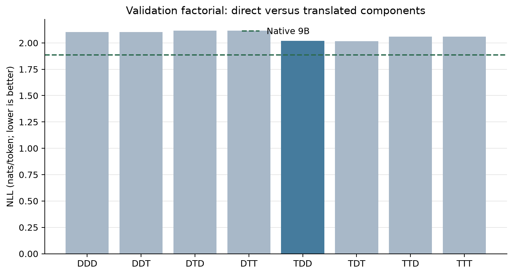
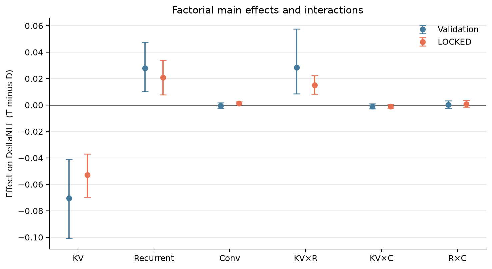
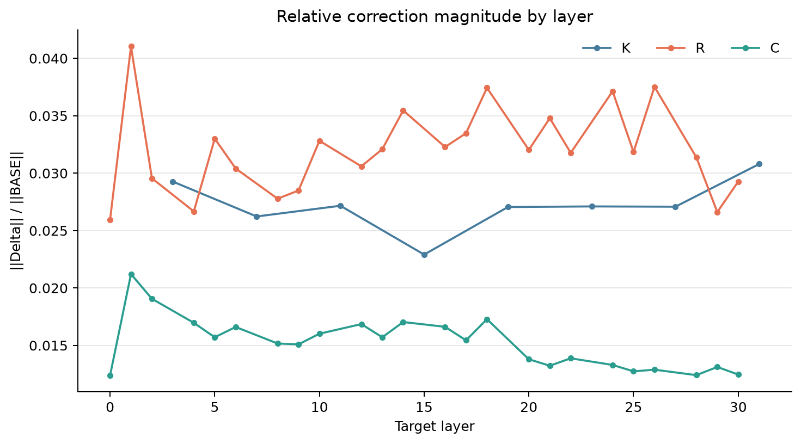
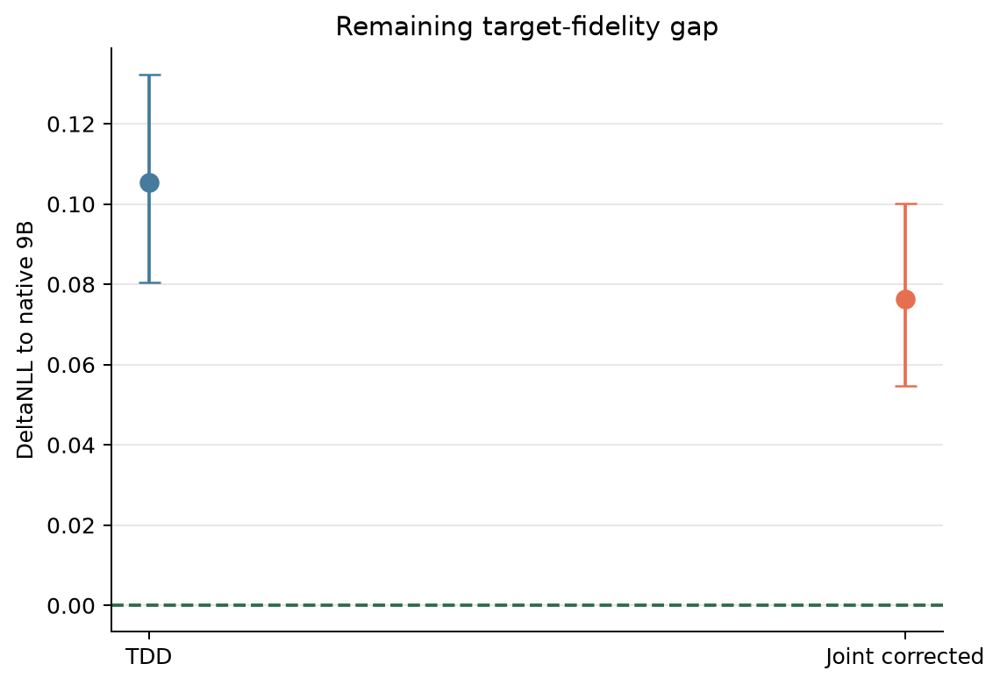
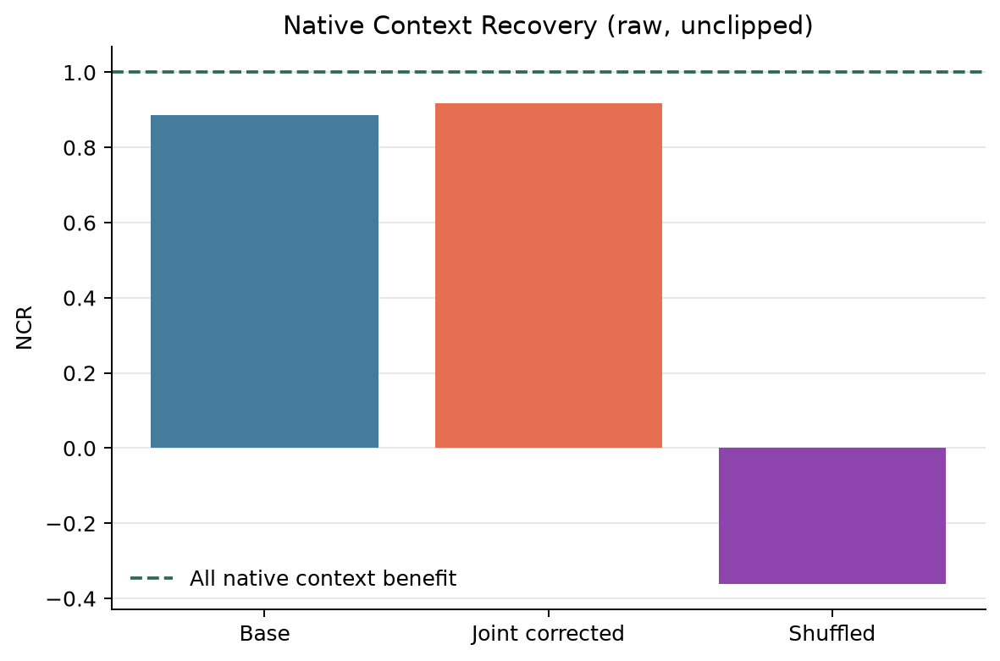
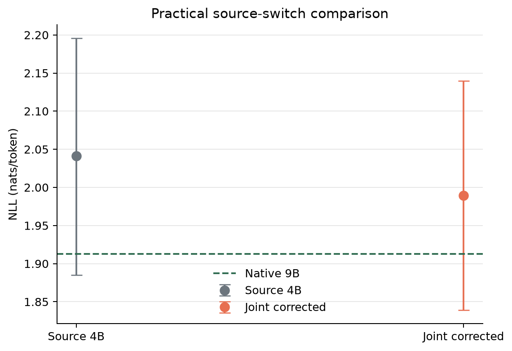
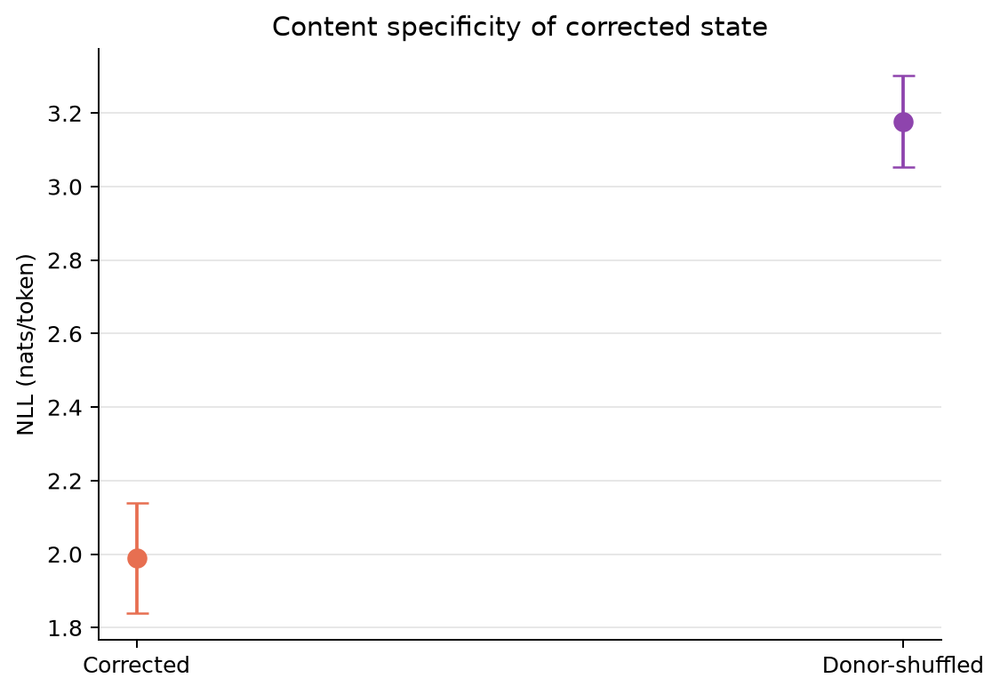
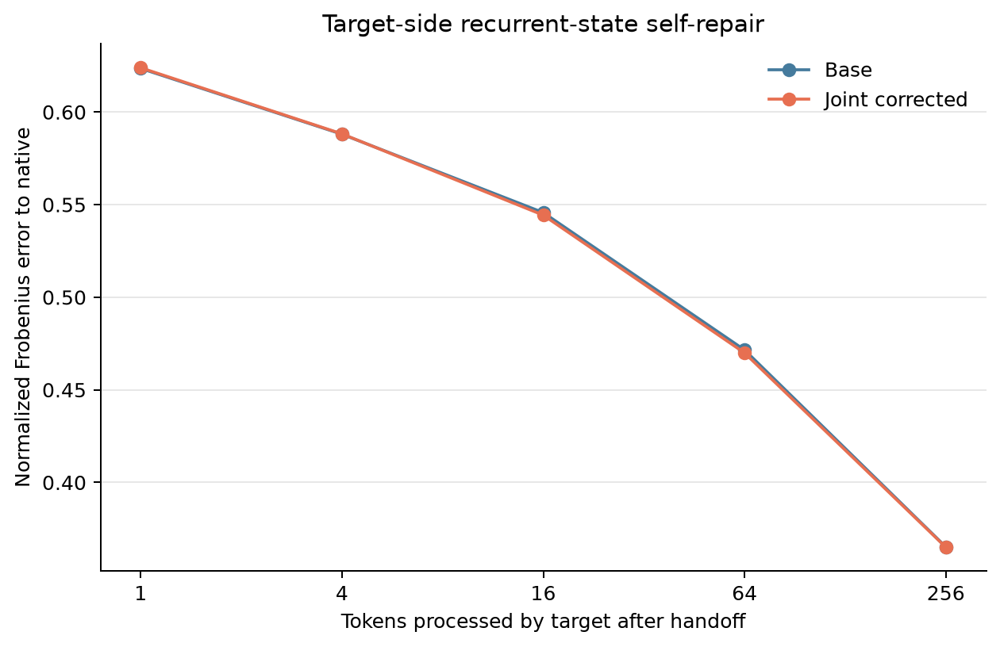
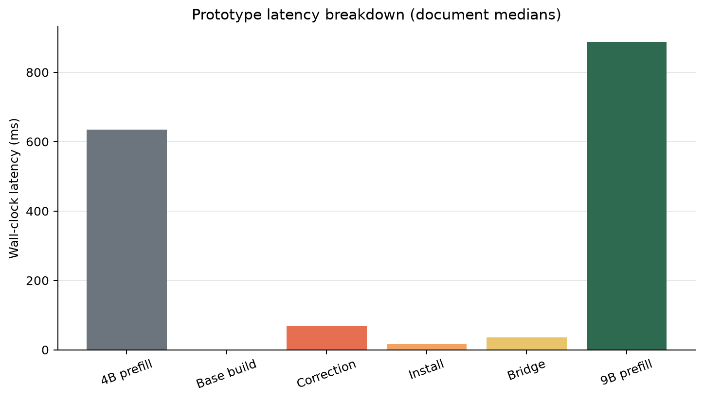
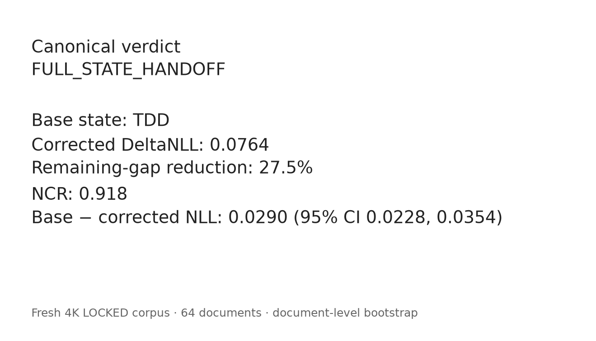

# LatentPort E002: Coupler

## Can a Small Identity-Anchored Correction Turn Cross-Model State Transfer Into Near-Native Handoff?

# Executive Finding

Validation selected `TDD`: translated KV with direct recurrent and convolution state. The validation factorial showed no directionally replicated material interaction under the preregistered 0.02-nat interaction threshold. On fresh LOCKED data, the direct-heavy base significantly outperformed `TTT`; the paired 95% interval for `TTT − BASE_STATE` was [0.016969, 0.041782] nats/token.

The selected rank-4 correction used 434,176 trainable parameters (1,901,432 serialized bytes). Its median and maximum layer-relative magnitudes were 0.026432 and 0.043951. Joint correction changed DeltaNLL from 0.105390 to 0.076367; remaining-gap reduction was 27.5%, and the paired interval for `BASE_STATE − JOINT_CORRECTED` was [0.022828, 0.035413]. It therefore met the preregistered correction-success gate.

Corrected handoff significantly beat continued 4B inference; `corrected − source` was -0.052144 with 95% interval [-0.084348, -0.018539]. It recovered 91.8% of native 9B context benefit (NCR 0.917755). The donor-shuffled control was significantly worse, supporting content specificity.

The corrected recurrent-state error shrunk from token 1 to token 256. The 16K phase was not run because the frozen 4K verdict did not reach NEAR_NATIVE_HANDOFF. The canonical verdict is `FULL_STATE_HANDOFF`. The exact next hypothesis is: **H3: The remaining fidelity gap is dominated by a small subset of layers/components identified by E002 post-verdict ablations, and correcting only those components can preserve handoff quality at lower translation cost.**

## Experimental Integrity

E001 remained sealed as prior evidence. E002 independently reverified its manifest, model shards, tokenizer, state schemas, translators, runtime, and read-only training-state loads. E001 LOCKED document outcomes were not parsed or used for E002 fitting or selection. The fresh factorial set was frozen before factorial inspection; the fresh LOCKED and LONG IDs, selected correction, code, hashes, and base state were frozen before the one-shot LOCKED run.

### Table 1: E001 fixed inputs

| Item | Value | Hash verified? |
|---|---|---|
| E001 verdict | `RECURRENT_STATE_TRANSLATABLE` | yes |
| E001 frozen manifest | `69bcca1bea1ecce2cc5c7c9728581aeca8ed9abf56028c2cd9c2fd7498efb0c9` | yes |
| Source | `Qwen/Qwen3.5-4B-Base@1001bb4d826a52d1f399e183466143f4da7b741b` | yes |
| Target | `Qwen/Qwen3.5-9B-Base@68c46c4b3498877f3ef123c856ecfde50c39f404` | yes |
| KV translator tensor | `d4b11e27da1ca504dd0ab3188e31587560baf33a4b0fc3faf811833f8998b257` | yes |
| Recurrent translator tensor | `f5db76bfb3e32b3ae8950bfaa67259725d77860145779e7b527157a51e0f9892` | yes |
| Convolution translator tensor | `2b580b1952f9835c9954850a4ea48ee986f1bb2cd0daca351a641e0c59e49a55` | yes |

## Which State Components Actually Need Translation?

The full validation factorial was completed before correction fitting. Negative effects mean translation lowered DeltaNLL; positive effects mean direct copy was better.

### Table 2: Validation factorial

| Condition | KV | Recurrent | Conv | NLL | DeltaNLL |
|---|---|---|---|---:|---:|
| DDD | D | D | D | 2.102868 | 0.217430 |
| DDT | D | D | T | 2.102911 | 0.217473 |
| DTD | D | T | D | 2.116663 | 0.231225 |
| DTT | D | T | T | 2.116688 | 0.231250 |
| TDD | T | D | D | 2.018815 | 0.133377 |
| TDT | T | D | T | 2.017664 | 0.132226 |
| TTD | T | T | D | 2.060715 | 0.175278 |
| TTT | T | T | T | 2.060082 | 0.174644 |

### Table 3: Factorial effects

| Effect | Estimate | 95% CI | Interpretation |
|---|---:|---:|---|
| KV representation | -0.070463 | [-0.100867, -0.040946] | translated preferred |
| Recurrent representation | 0.027973 | [0.010360, 0.047548] | direct preferred |
| Convolution representation | -0.000429 | [-0.002647, 0.001774] | translated preferred |
| KV × recurrent | 0.028373 | [0.008556, 0.057582] | material interaction |
| KV × convolution | -0.000927 | [-0.002873, 0.001039] | small interaction |
| Recurrent × convolution | 0.000250 | [-0.002447, 0.003218] | small interaction |

Plainly: KV preferred **translated**, recurrent preferred **direct**, and convolution preferred **translated** on validation. The validation interaction pattern did not replicate as a material coupling pattern on LOCKED data. The remaining handoff gap is not primarily explained by cross-component coupling under this design.

### Table 4: Base-state selection

| Candidate | Validation DeltaNLL | Complexity rank | Selected? |
|---|---:|---:|---|
| DDD | 0.217430 | 0 | no |
| DDT | 0.217473 | 1 | no |
| DTD | 0.231225 | 1 | no |
| DTT | 0.231250 | 2 | no |
| TDD | 0.133377 | 1 | yes |
| TDT | 0.132226 | 2 | no |
| TTD | 0.175278 | 2 | no |
| TTT | 0.174644 | 3 | no |

## Does Qwen3.5 Already Share a Recurrent Memory Interface Across Model Sizes?

E001 found that translated KV plus directly copied source Gated DeltaNet state beat full translation. E002 replicated the component-level test without selecting from E001 LOCKED outcomes. The central LOCKED conditions were:

| Condition | NLL | DeltaNLL |
|---|---:|---:|
| DDD | 2.078195 | 0.165163 |
| TDD | 2.018422 | 0.105390 |
| TTT | 2.047468 | 0.134437 |
| BASE_STATE | 2.018422 | 0.105390 |
| JOINT_CORRECTED | 1.989399 | 0.076367 |

The results are consistent with a partially shared functional state coordinate system across Qwen3.5 sibling models. This is functional compatibility evidence, not a claim of an identical representation or formal ABI.

## Is the Correction Small Enough to Support the Shared-State Interpretation?

### Table 5: Correction inventory

| Component | Rank/type | Parameters | Median relative correction |
|---|---|---:|---:|
| KV | rank 4 residual | 16,384 | 0.027093 |
| Recurrent | rank 4 left/right residual | 24,576 | 0.031916 |
| Convolution | diagonal scale + bias | 393,216 | 0.015320 |
| **Total** | identity-anchored | **434,176** | **0.026432** |

The artifact occupies 1,901,432 bytes, or 1.062e-04 of target-model bfloat16 weight bytes. The maximum observed layer-relative correction was 0.043951. Magnitude is reported as mechanistic evidence and was not used as a success gate.

## LOCKED Fidelity

### Table 6: LOCKED fidelity

| Condition | NLL | DeltaNLL | NCR | TQR | Top-1 vs native | JS |
|---|---:|---:|---:|---:|---:|---:|
| NATIVE_9B | 1.913032 | 0.000000 | 1.000000 | 1.000000 | 1.000000 | 0.000000 |
| SOURCE_4B | 2.041544 | 0.128512 | 0.861597 | 0.000000 | 0.833984 | 0.038052 |
| EMPTY_9B | 2.841564 | 0.928532 | 0.000000 | -6.225273 | 0.626465 | 0.156773 |
| DDD | 2.078195 | 0.165163 | 0.822125 | -0.285197 | 0.809082 | 0.043300 |
| DDT | 2.079621 | 0.166589 | 0.820589 | -0.296294 | 0.809082 | 0.043349 |
| DTD | 2.091170 | 0.178138 | 0.808151 | -0.386159 | 0.812012 | 0.046724 |
| DTT | 2.093085 | 0.180053 | 0.806089 | -0.401061 | 0.810791 | 0.047092 |
| TDD | 2.018422 | 0.105390 | 0.886498 | 0.179921 | 0.846436 | 0.028583 |
| TDT | 2.018709 | 0.105677 | 0.886189 | 0.177683 | 0.846191 | 0.028682 |
| TTD | 2.046234 | 0.133202 | 0.856545 | -0.036501 | 0.832520 | 0.035792 |
| TTT | 2.047468 | 0.134437 | 0.855216 | -0.046104 | 0.832031 | 0.036172 |
| BASE_STATE | 2.018422 | 0.105390 | 0.886498 | 0.179921 | 0.846436 | 0.028583 |
| JOINT_CORRECTED | 1.989399 | 0.076367 | 0.917755 | 0.405755 | 0.864258 | 0.022067 |
| JOINT_SHUFFLED | 3.177764 | 1.264732 | -0.362078 | -8.841385 | 0.578369 | 0.192132 |

## Does a Small Correction Beat the Best Raw Handoff?

### Table 7: Primary correction effect

| Metric | BASE_STATE | JOINT_CORRECTED | Delta | 95% CI |
|---|---:|---:|---:|---:|
| NLL | 2.018422 | 1.989399 | -0.029022 corrected − base | [0.022828, 0.035413] base − corrected |
| DeltaNLL | 0.105390 | 0.076367 | -0.029022 | same paired NLL interval |
| NCR | 0.886498 | 0.917755 | 0.031256 | descriptive |
| RGR | — | 0.275382 | — | [0.224143, 0.338594] |

The correction materially improved the strongest uncorrected handoff.

## Is Switching to the 9B Actually Better Than Staying on the 4B?

### Table 8: Practical source switch

| Metric | SOURCE_4B | JOINT_CORRECTED | Difference | 95% CI |
|---|---:|---:|---:|---:|
| NLL | 2.041544 | 1.989399 | -0.052144 corrected − source | [-0.084348, -0.018539] |

Corrected handoff significantly beat SOURCE_4B under the frozen document bootstrap.

## Did Corrected State Remain Content-Specific?

### Table 9: Content specificity

| Metric | JOINT_CORRECTED | JOINT_SHUFFLED | Difference | 95% CI |
|---|---:|---:|---:|---:|
| NLL | 1.989399 | 3.177764 | -1.188365 corrected − shuffled | [-1.295645, -1.085469] |

The no-fixed-point donor rotation was significantly worse, supporting content-specific transferred memory.

## Does the Target Repair the Imported State?

### Table 10: State repair

| Token | BASE recurrent error | Corrected recurrent error | BASE cosine | Corrected cosine |
|---:|---:|---:|---:|---:|
| 1 | 0.623536 | 0.623898 | 0.777969 | 0.777777 |
| 4 | 0.588019 | 0.588214 | 0.805425 | 0.805294 |
| 16 | 0.545705 | 0.544322 | 0.835072 | 0.835844 |
| 64 | 0.471536 | 0.469922 | 0.878078 | 0.878880 |
| 256 | 0.365184 | 0.364990 | 0.926513 | 0.926614 |

Corrected recurrent error shrunk over 256 tokens. This trajectory is secondary mechanistic evidence, not an additional verdict gate.

## Could This Be Faster Than Re-Prefilling?

### Table 11: Timing

| Stage | Latency |
|---|---:|
| Native 9B prefill | 886.646 ms |
| Source 4B prefill | 634.911 ms |
| Base-state construction | 0.041 ms |
| Joint correction | 69.145 ms |
| State installation | 15.829 ms |
| Bridge token | 35.410 ms |
| Available translation budget | 251.736 ms |
| Handoff margin | 131.310 ms |

These are prototype end-to-end wall-clock medians. E002 does not claim a production speedup.

## 16K Generalization

The 16K phase was not run because the frozen 4K verdict did not reach NEAR_NATIVE_HANDOFF.

## Where Does the Remaining Mismatch Live?

These ablations were run only after the 4K verdict was frozen and were not used to alter E002.

| Post-verdict ablation | DeltaNLL | Impact vs full correction | 95% CI |
|---|---:|---:|---:|
| CONVOLUTION_CORRECTION_REMOVED | 0.077026 | 0.000658 | [-0.000387, 0.001685] |
| EARLY_THIRD_RECURRENT_REMOVED | 0.082034 | 0.005666 | [0.002873, 0.008594] |
| KV_CORRECTION_REMOVED | 0.083648 | 0.007281 | [0.004475, 0.010285] |
| LATE_THIRD_RECURRENT_REMOVED | 0.077912 | 0.001545 | [0.000136, 0.002925] |
| MIDDLE_THIRD_RECURRENT_REMOVED | 0.086258 | 0.009891 | [0.006875, 0.013005] |
| RECURRENT_CORRECTION_REMOVED | 0.095287 | 0.018920 | [0.014069, 0.024019] |

## Canonical Verdict and Next Hypothesis

**Canonical verdict: `FULL_STATE_HANDOFF`.**

**Exact next hypothesis: H3: The remaining fidelity gap is dominated by a small subset of layers/components identified by E002 post-verdict ablations, and correcting only those components can preserve handoff quality at lower translation cost.**

## Claim Limits

The evidence concerns this frozen Qwen3.5-4B-Base → Qwen3.5-9B-Base pair and the specified state installation path. It does not establish universal state portability, cross-family transfer, architecture-independent memory, a formal ABI, or production-ready routing.
